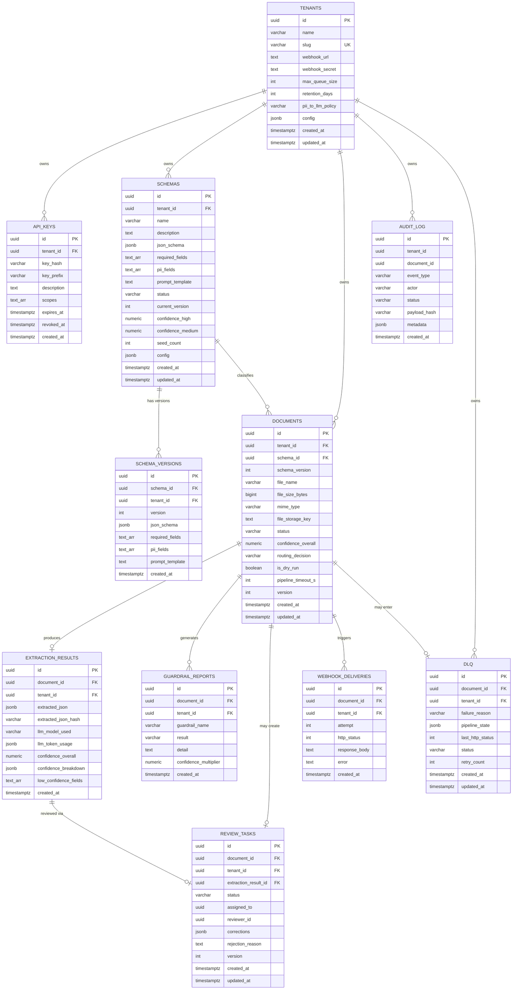

# Data Model -- Enterprise OCR / Document Extraction Platform
**Date:** 2026-06-09  **Author:** @data-modeler  **Status:** FINALIZED
**Sources:** `docs/sdlc/02-requirements.md`, `docs/sdlc/03-architecture.md`

---

## 1. Entity Registry

| Entity | Table name | Owner service | Volume estimate (yr1) | Retention |
|--------|-----------|--------------|----------------------|----------|
| Tenant | `tenants` | Admin Module | ~100 rows (slow growth) | Permanent |
| API Key | `api_keys` | Admin Module | ~500 (5/tenant avg) | Permanent (soft-revoke) |
| Schema | `schemas` | Schema Registry | ~300 (3/tenant avg) | Permanent |
| Schema Version | `schema_versions` | Schema Registry | ~900 (3 versions/schema avg) | Permanent |
| Document | `documents` | Ingest Module | ~52M (1000/min peak * 365d) | Per-tenant retention_days (default 90d) |
| Extraction Result | `extraction_results` | Extraction Pipeline | ~52M (1:1 with documents) | Cascades with document |
| Guardrail Report | `guardrail_reports` | Extraction Pipeline | ~156M (3 guardrails/doc avg) | Cascades with document |
| Review Task | `review_tasks` | Review Module | ~7.8M (~15% MEDIUM) | Cascades with document |
| Audit Log | `audit_log` | Audit Service | ~260M (5 events/doc avg) | Per-tenant retention_days; tombstones permanent |
| Dead Letter Queue | `dlq` | DLQ Module | ~2.6M (~5% of docs) | Per-tenant retention_days |
| Webhook Delivery | `webhook_deliveries` | Webhook Delivery | ~78M (avg 1.5 attempts/doc) | Cascades with document |

**LangGraph Checkpoints** -- managed by `langgraph-checkpoint-postgres` library. Tables auto-created: `checkpoints(thread_id, checkpoint_id, parent_id, checkpoint, metadata, created_at)`. `thread_id = document_id`. Not modeled here; purged alongside documents.

---

## 2. Entity-Relationship Diagram

```
                              +-------------------+
                              |     tenants       |
                              |-------------------|
                              | id (PK, UUID)     |
                              | name              |
                              | slug (UK)         |
                              | webhook_url       |
                              | webhook_secret    |
                              | max_queue_size    |
                              | retention_days    |
                              | pii_to_llm_policy |
                              | config (JSONB)    |
                              | created_at        |
                              | updated_at        |
                              +--------+----------+
                                       |
            +-------------+------------+----------+-----------+----------+
            |             |            |          |           |          |
            | 1:N         | 1:N        | 1:N      | 1:N       | 1:N      |
            v             v            v          v           v          v
    +-------+------+ +----+------+ +--+--------+ +--+------+ +--+-----+ +--+----------+
    |   api_keys   | |  schemas  | | documents | | dlq     | |audit_log| |webhook_del.|
    +--------------+ +-----------+ +-----------+ +---------+ +---------+ +-------------+
                     | id (PK)   | | id (PK)   |
                     | tenant_id | | tenant_id |
                     | name (UK  | | schema_id |--+
                     |  w/tenant)| | schema_ver|  |
                     +-+---+-----+ +--+--+--+--+  |
                       |   |          |  |  |      |
                       |   | 1:N      |  |  |      |
                       |   v          |  |  |      |
                  +----+----------+   |  |  |      |
                  |schema_versions|   |  |  |      |
                  |---------------|   |  |  |      |
                  | schema_id(FK) |<--+  |  |      |
                  | version       |      |  |      |
                  +---------------+      |  |      |
                                         |  |      |
                        +----------------+  |      |
                        |                   |      |
                        v 1:1               v 1:N  |
               +--------+----------+  +-----+----------+
               |extraction_results |  |guardrail_reports|
               |-------------------|  |-----------------|
               | document_id (FK)  |  | document_id(FK) |
               | tenant_id         |  | tenant_id       |
               +--------+----------+  +-----------------+
                        |
                        | 1:1
                        v
               +--------+----------+
               |   review_tasks    |
               |-------------------|
               | document_id (FK)  |
               | extraction_result |
               |   _id (FK)        |
               | tenant_id         |
               +-------------------+

    Cardinalities:
    tenants       1 --< N  api_keys
    tenants       1 --< N  schemas
    tenants       1 --< N  documents
    tenants       1 --< N  audit_log
    tenants       1 --< N  dlq
    tenants       1 --< N  webhook_deliveries
    schemas       1 --< N  schema_versions
    schemas       1 --< N  documents
    documents     1 --  1  extraction_results
    documents     1 --< N  guardrail_reports
    documents     1 --  1  review_tasks (0..1 actually)
    documents     1 --< N  webhook_deliveries
    documents     1 --  1  dlq (0..1 actually)
    extraction_results 1 --  1  review_tasks (0..1)
```

### Mermaid ERD



---

## 3. Full DDL

### 3.1 Extensions and Roles

```sql
-- =============================================================================
-- Migration 001: Extensions, roles, and utility functions
-- =============================================================================

-- Required extensions
CREATE EXTENSION IF NOT EXISTS "pgcrypto";       -- gen_random_uuid()
CREATE EXTENSION IF NOT EXISTS "pg_trgm";        -- trigram index for text search (future)

-- Application role (used by FastAPI / worker connections)
-- RLS policies will apply to this role
CREATE ROLE ocr_app LOGIN PASSWORD 'changeme_in_production';

-- Admin role for GDPR erasure and nightly purge (bypasses RLS)
CREATE ROLE ocr_admin NOLOGIN BYPASSRLS;

-- updated_at trigger function (reusable)
CREATE OR REPLACE FUNCTION trigger_set_updated_at()
RETURNS TRIGGER AS $$
BEGIN
    NEW.updated_at = NOW();
    RETURN NEW;
END;
$$ LANGUAGE plpgsql;
```

### 3.2 Core Tables

```sql
-- =============================================================================
-- Migration 001: Core tables
-- =============================================================================

-- ---------------------------------------------------------------------------
-- TENANTS
-- ---------------------------------------------------------------------------
CREATE TABLE tenants (
    id                  UUID PRIMARY KEY DEFAULT gen_random_uuid(),
    name                VARCHAR(255) NOT NULL,
    slug                VARCHAR(63) NOT NULL UNIQUE,
    webhook_url         TEXT,
    webhook_secret      TEXT NOT NULL,
    max_queue_size      INT NOT NULL DEFAULT 500
                            CHECK (max_queue_size > 0 AND max_queue_size <= 10000),
    retention_days      INT NOT NULL DEFAULT 90
                            CHECK (retention_days >= 1 AND retention_days <= 3650),
    pii_to_llm_policy   VARCHAR(30) NOT NULL DEFAULT 'ENCRYPT_BEFORE_LLM'
                            CHECK (pii_to_llm_policy IN (
                                'ENCRYPT_BEFORE_LLM',
                                'REDACT_BEFORE_LLM',
                                'ALLOW_PLAINTEXT'
                            )),
    config              JSONB NOT NULL DEFAULT '{}',
    created_at          TIMESTAMPTZ NOT NULL DEFAULT NOW(),
    updated_at          TIMESTAMPTZ NOT NULL DEFAULT NOW()
);

CREATE TRIGGER trg_tenants_updated_at
    BEFORE UPDATE ON tenants
    FOR EACH ROW EXECUTE FUNCTION trigger_set_updated_at();

-- NOTE: tenants table does NOT have RLS. Tenant lookup is done by the auth
-- middleware before the session var is set. Only api_keys and downstream
-- tables are tenant-scoped.

-- ---------------------------------------------------------------------------
-- API KEYS
-- ---------------------------------------------------------------------------
CREATE TABLE api_keys (
    id                  UUID PRIMARY KEY DEFAULT gen_random_uuid(),
    tenant_id           UUID NOT NULL REFERENCES tenants(id) ON DELETE CASCADE,
    key_hash            VARCHAR(128) NOT NULL,
    key_prefix          VARCHAR(8) NOT NULL,
    description         TEXT,
    scopes              TEXT[] NOT NULL DEFAULT '{extract,read}',
    expires_at          TIMESTAMPTZ,
    revoked_at          TIMESTAMPTZ,
    created_at          TIMESTAMPTZ NOT NULL DEFAULT NOW()
);

-- Key lookup by hash (primary query path for auth)
CREATE UNIQUE INDEX idx_api_keys_key_hash ON api_keys(key_hash);
-- Tenant listing
CREATE INDEX idx_api_keys_tenant_id ON api_keys(tenant_id);

-- ---------------------------------------------------------------------------
-- SCHEMAS (document types / extraction templates)
-- ---------------------------------------------------------------------------
CREATE TABLE schemas (
    id                  UUID PRIMARY KEY DEFAULT gen_random_uuid(),
    tenant_id           UUID NOT NULL REFERENCES tenants(id) ON DELETE CASCADE,
    name                VARCHAR(255) NOT NULL,
    description         TEXT,
    json_schema         JSONB NOT NULL,
    required_fields     TEXT[] NOT NULL DEFAULT '{}',
    pii_fields          TEXT[] NOT NULL DEFAULT '{}',
    prompt_template     TEXT,
    status              VARCHAR(20) NOT NULL DEFAULT 'draft'
                            CHECK (status IN ('draft', 'active', 'deprecated')),
    current_version     INT NOT NULL DEFAULT 1
                            CHECK (current_version >= 1),
    confidence_high     NUMERIC(4,3) NOT NULL DEFAULT 0.850
                            CHECK (confidence_high > confidence_medium
                                   AND confidence_high <= 1.0),
    confidence_medium   NUMERIC(4,3) NOT NULL DEFAULT 0.600
                            CHECK (confidence_medium >= 0.0
                                   AND confidence_medium < confidence_high),
    seed_count          INT NOT NULL DEFAULT 0
                            CHECK (seed_count >= 0),
    config              JSONB NOT NULL DEFAULT '{}',
    created_at          TIMESTAMPTZ NOT NULL DEFAULT NOW(),
    updated_at          TIMESTAMPTZ NOT NULL DEFAULT NOW(),

    CONSTRAINT uq_schemas_tenant_name UNIQUE (tenant_id, name)
);

CREATE INDEX idx_schemas_tenant_id ON schemas(tenant_id);
CREATE INDEX idx_schemas_tenant_status ON schemas(tenant_id, status);

CREATE TRIGGER trg_schemas_updated_at
    BEFORE UPDATE ON schemas
    FOR EACH ROW EXECUTE FUNCTION trigger_set_updated_at();

-- Activation gate: cannot set status='active' unless seed_count >= 3
-- Enforced via CHECK constraint on the combination
-- (Application-level enforcement is primary; this is defense-in-depth)
CREATE OR REPLACE FUNCTION check_schema_activation()
RETURNS TRIGGER AS $$
BEGIN
    IF NEW.status = 'active' AND NEW.seed_count < 3 THEN
        RAISE EXCEPTION 'Schema activation requires at least 3 seed examples (has %)', NEW.seed_count;
    END IF;
    RETURN NEW;
END;
$$ LANGUAGE plpgsql;

CREATE TRIGGER trg_schema_activation_gate
    BEFORE INSERT OR UPDATE ON schemas
    FOR EACH ROW EXECUTE FUNCTION check_schema_activation();

-- ---------------------------------------------------------------------------
-- SCHEMA VERSIONS (immutable snapshots)
-- ---------------------------------------------------------------------------
CREATE TABLE schema_versions (
    id                  UUID PRIMARY KEY DEFAULT gen_random_uuid(),
    schema_id           UUID NOT NULL REFERENCES schemas(id) ON DELETE CASCADE,
    tenant_id           UUID NOT NULL REFERENCES tenants(id) ON DELETE CASCADE,
    version             INT NOT NULL CHECK (version >= 1),
    json_schema         JSONB NOT NULL,
    required_fields     TEXT[] NOT NULL,
    pii_fields          TEXT[] NOT NULL,
    prompt_template     TEXT,
    created_at          TIMESTAMPTZ NOT NULL DEFAULT NOW(),

    CONSTRAINT uq_schema_versions_schema_version UNIQUE (schema_id, version)
);

CREATE INDEX idx_schema_versions_schema_id ON schema_versions(schema_id);
CREATE INDEX idx_schema_versions_tenant_id ON schema_versions(tenant_id);

-- ---------------------------------------------------------------------------
-- DOCUMENTS
-- ---------------------------------------------------------------------------
CREATE TABLE documents (
    id                  UUID PRIMARY KEY DEFAULT gen_random_uuid(),
    tenant_id           UUID NOT NULL REFERENCES tenants(id) ON DELETE CASCADE,
    schema_id           UUID NOT NULL REFERENCES schemas(id),
    schema_version      INT NOT NULL,
    file_name           VARCHAR(512),
    file_size_bytes     BIGINT CHECK (file_size_bytes >= 0),
    mime_type           VARCHAR(100),
    file_storage_key    TEXT,
    status              VARCHAR(30) NOT NULL DEFAULT 'pending'
                            CHECK (status IN (
                                'pending', 'parsing', 'guarding', 'extracting',
                                'scoring', 'routing', 'delivering',
                                'completed', 'review', 'rejected', 'error',
                                'cancelled', 'tombstone'
                            )),
    confidence_overall  NUMERIC(4,3) CHECK (confidence_overall >= 0 AND confidence_overall <= 1.0),
    routing_decision    VARCHAR(10) CHECK (routing_decision IN ('HIGH', 'MEDIUM', 'LOW')),
    is_dry_run          BOOLEAN NOT NULL DEFAULT false,
    pipeline_timeout_s  INT NOT NULL DEFAULT 60
                            CHECK (pipeline_timeout_s >= 5 AND pipeline_timeout_s <= 600),
    version             INT NOT NULL DEFAULT 1,
    created_at          TIMESTAMPTZ NOT NULL DEFAULT NOW(),
    updated_at          TIMESTAMPTZ NOT NULL DEFAULT NOW()
);

-- Primary query patterns:
-- 1. List documents by tenant + status (review queue, admin dashboard)
-- 2. List documents by tenant + created_at (date range queries, retention purge)
-- 3. Single document by id (pipeline processing, API detail)
CREATE INDEX idx_documents_tenant_status ON documents(tenant_id, status);
CREATE INDEX idx_documents_tenant_created ON documents(tenant_id, created_at);
-- Partial index for retention purge: only non-tombstone docs with created_at filter
CREATE INDEX idx_documents_retention_purge
    ON documents(tenant_id, created_at)
    WHERE status NOT IN ('tombstone', 'cancelled');
-- Partial index for pending pipeline recovery
CREATE INDEX idx_documents_pending_recovery
    ON documents(status, created_at)
    WHERE status IN ('pending', 'parsing', 'guarding', 'extracting', 'scoring', 'routing', 'delivering');

CREATE TRIGGER trg_documents_updated_at
    BEFORE UPDATE ON documents
    FOR EACH ROW EXECUTE FUNCTION trigger_set_updated_at();

-- ---------------------------------------------------------------------------
-- EXTRACTION RESULTS
-- ---------------------------------------------------------------------------
CREATE TABLE extraction_results (
    id                      UUID PRIMARY KEY DEFAULT gen_random_uuid(),
    document_id             UUID NOT NULL REFERENCES documents(id) ON DELETE CASCADE,
    tenant_id               UUID NOT NULL REFERENCES tenants(id) ON DELETE CASCADE,
    extracted_json          JSONB,
    extracted_json_hash     VARCHAR(64),
    llm_model_used          VARCHAR(100),
    llm_token_usage         JSONB,
    confidence_overall      NUMERIC(4,3),
    confidence_breakdown    JSONB,
    low_confidence_fields   TEXT[],
    missing_fields          TEXT[],
    created_at              TIMESTAMPTZ NOT NULL DEFAULT NOW()
);

-- 1:1 with document; unique constraint enforces this
CREATE UNIQUE INDEX idx_extraction_results_document_id
    ON extraction_results(document_id);
CREATE INDEX idx_extraction_results_tenant_id
    ON extraction_results(tenant_id);

-- ---------------------------------------------------------------------------
-- GUARDRAIL REPORTS
-- ---------------------------------------------------------------------------
CREATE TABLE guardrail_reports (
    id                      UUID PRIMARY KEY DEFAULT gen_random_uuid(),
    document_id             UUID NOT NULL REFERENCES documents(id) ON DELETE CASCADE,
    tenant_id               UUID NOT NULL REFERENCES tenants(id) ON DELETE CASCADE,
    guardrail_name          VARCHAR(100) NOT NULL,
    result                  VARCHAR(10) NOT NULL
                                CHECK (result IN ('pass', 'warn', 'block')),
    detail                  TEXT,
    confidence_multiplier   NUMERIC(4,3) NOT NULL DEFAULT 1.000
                                CHECK (confidence_multiplier > 0 AND confidence_multiplier <= 1.0),
    created_at              TIMESTAMPTZ NOT NULL DEFAULT NOW()
);

CREATE INDEX idx_guardrail_reports_document_id ON guardrail_reports(document_id);
CREATE INDEX idx_guardrail_reports_tenant_id ON guardrail_reports(tenant_id);

-- ---------------------------------------------------------------------------
-- REVIEW TASKS
-- ---------------------------------------------------------------------------
CREATE TABLE review_tasks (
    id                      UUID PRIMARY KEY DEFAULT gen_random_uuid(),
    document_id             UUID NOT NULL REFERENCES documents(id) ON DELETE CASCADE,
    tenant_id               UUID NOT NULL REFERENCES tenants(id) ON DELETE CASCADE,
    extraction_result_id    UUID NOT NULL REFERENCES extraction_results(id) ON DELETE CASCADE,
    status                  VARCHAR(20) NOT NULL DEFAULT 'pending'
                                CHECK (status IN (
                                    'pending', 'in_progress', 'accepted',
                                    'corrected', 'rejected'
                                )),
    assigned_to             UUID,
    reviewer_id             UUID,
    corrections             JSONB,
    rejection_reason        TEXT,
    version                 INT NOT NULL DEFAULT 1,
    created_at              TIMESTAMPTZ NOT NULL DEFAULT NOW(),
    updated_at              TIMESTAMPTZ NOT NULL DEFAULT NOW()
);

-- Review queue listing: tenant + status (most common query)
CREATE INDEX idx_review_tasks_tenant_status ON review_tasks(tenant_id, status);
-- Stale review detection: items older than 24h still pending
CREATE INDEX idx_review_tasks_stale
    ON review_tasks(created_at)
    WHERE status IN ('pending', 'in_progress');
-- 1 review per document (at most)
CREATE UNIQUE INDEX idx_review_tasks_document_id ON review_tasks(document_id);

CREATE TRIGGER trg_review_tasks_updated_at
    BEFORE UPDATE ON review_tasks
    FOR EACH ROW EXECUTE FUNCTION trigger_set_updated_at();

-- ---------------------------------------------------------------------------
-- AUDIT LOG (append-only)
-- ---------------------------------------------------------------------------
CREATE TABLE audit_log (
    id                  UUID PRIMARY KEY DEFAULT gen_random_uuid(),
    tenant_id           UUID NOT NULL,
    document_id         UUID,
    event_type          VARCHAR(50) NOT NULL,
    actor               VARCHAR(255),
    status              VARCHAR(30),
    payload_hash        VARCHAR(64),
    metadata            JSONB,
    created_at          TIMESTAMPTZ NOT NULL DEFAULT NOW()
);

-- NOTE: No FK on tenant_id or document_id. Audit log must survive even after
-- document deletion (GDPR tombstone pattern). The tombstone row remains.
-- Query patterns:
-- 1. By tenant + date range (audit export REQ-038)
-- 2. By document (pipeline audit trail)
-- 3. By event_type (incident investigation)
CREATE INDEX idx_audit_log_tenant_created ON audit_log(tenant_id, created_at);
CREATE INDEX idx_audit_log_document_id ON audit_log(document_id) WHERE document_id IS NOT NULL;
CREATE INDEX idx_audit_log_event_type ON audit_log(tenant_id, event_type);

-- Immutability enforcement (REQ-037, D-011)
CREATE OR REPLACE FUNCTION prevent_audit_modification()
RETURNS TRIGGER AS $$
BEGIN
    RAISE EXCEPTION 'audit_log records cannot be modified or deleted (immutability policy)';
END;
$$ LANGUAGE plpgsql;

-- Block all UPDATEs unconditionally
CREATE TRIGGER trg_audit_no_update
    BEFORE UPDATE ON audit_log
    FOR EACH ROW EXECUTE FUNCTION prevent_audit_modification();

-- Block DELETEs except for GDPR erasure tombstone cleanup
-- Tombstone records (event_type ERASURE_*) are the evidence; they are never deleted.
-- Original content audit records ARE deleted during GDPR erasure, but only via
-- the ocr_admin role which bypasses RLS. The trigger below blocks app-role deletes.
CREATE TRIGGER trg_audit_no_delete
    BEFORE DELETE ON audit_log
    FOR EACH ROW EXECUTE FUNCTION prevent_audit_modification();

-- For GDPR erasure, the ocr_admin role temporarily disables this trigger:
--   ALTER TABLE audit_log DISABLE TRIGGER trg_audit_no_delete;
--   DELETE FROM audit_log WHERE document_id = $1 AND event_type NOT LIKE 'ERASURE_%';
--   ALTER TABLE audit_log ENABLE TRIGGER trg_audit_no_delete;
--   INSERT INTO audit_log (tenant_id, document_id, event_type, actor, metadata)
--     VALUES ($tenant_id, $doc_id, 'ERASURE_AT_REST', 'system:gdpr', '{"reason":"..."}');

-- ---------------------------------------------------------------------------
-- DEAD LETTER QUEUE
-- ---------------------------------------------------------------------------
CREATE TABLE dlq (
    id                  UUID PRIMARY KEY DEFAULT gen_random_uuid(),
    document_id         UUID NOT NULL REFERENCES documents(id) ON DELETE CASCADE,
    tenant_id           UUID NOT NULL REFERENCES tenants(id) ON DELETE CASCADE,
    failure_reason      VARCHAR(100) NOT NULL
                            CHECK (failure_reason IN (
                                'PARSE_FAILED', 'PARSE_EMPTY_OUTPUT',
                                'GUARDRAIL_BLOCK', 'INJECTION_DETECTED',
                                'LLM_UNAVAILABLE', 'EXTRACTION_FAILED',
                                'LOW_CONFIDENCE', 'PIPELINE_TIMEOUT',
                                'WEBHOOK_DELIVERY_FAILED', 'UNKNOWN'
                            )),
    pipeline_state      JSONB,
    last_http_status    INT,
    status              VARCHAR(20) NOT NULL DEFAULT 'pending'
                            CHECK (status IN ('pending', 'retrying', 'resolved', 'expired')),
    retry_count         INT NOT NULL DEFAULT 0
                            CHECK (retry_count >= 0),
    created_at          TIMESTAMPTZ NOT NULL DEFAULT NOW(),
    updated_at          TIMESTAMPTZ NOT NULL DEFAULT NOW()
);

-- DLQ listing: tenant + status (primary query path)
CREATE INDEX idx_dlq_tenant_status ON dlq(tenant_id, status);
-- DLQ by document (lookup for idempotency check)
CREATE INDEX idx_dlq_document_id ON dlq(document_id);

CREATE TRIGGER trg_dlq_updated_at
    BEFORE UPDATE ON dlq
    FOR EACH ROW EXECUTE FUNCTION trigger_set_updated_at();

-- ---------------------------------------------------------------------------
-- WEBHOOK DELIVERIES
-- ---------------------------------------------------------------------------
CREATE TABLE webhook_deliveries (
    id                  UUID PRIMARY KEY DEFAULT gen_random_uuid(),
    document_id         UUID NOT NULL REFERENCES documents(id) ON DELETE CASCADE,
    tenant_id           UUID NOT NULL REFERENCES tenants(id) ON DELETE CASCADE,
    attempt             INT NOT NULL CHECK (attempt >= 1 AND attempt <= 10),
    http_status         INT,
    response_body       TEXT,
    error               TEXT,
    created_at          TIMESTAMPTZ NOT NULL DEFAULT NOW()
);

CREATE INDEX idx_webhook_deliveries_document_id ON webhook_deliveries(document_id);
CREATE INDEX idx_webhook_deliveries_tenant_id ON webhook_deliveries(tenant_id);
```

### 3.3 Row-Level Security

```sql
-- =============================================================================
-- Migration 002: Row-Level Security policies
-- =============================================================================

-- Grant table access to app role
GRANT SELECT, INSERT, UPDATE, DELETE ON ALL TABLES IN SCHEMA public TO ocr_app;
GRANT USAGE, SELECT ON ALL SEQUENCES IN SCHEMA public TO ocr_app;

-- Grant full access to admin role (GDPR erasure, purge)
GRANT ALL ON ALL TABLES IN SCHEMA public TO ocr_admin;
GRANT ALL ON ALL SEQUENCES IN SCHEMA public TO ocr_admin;

-- ---------------------------------------------------------------------------
-- Enable RLS on all tenant-scoped tables
-- ---------------------------------------------------------------------------
ALTER TABLE api_keys ENABLE ROW LEVEL SECURITY;
ALTER TABLE schemas ENABLE ROW LEVEL SECURITY;
ALTER TABLE schema_versions ENABLE ROW LEVEL SECURITY;
ALTER TABLE documents ENABLE ROW LEVEL SECURITY;
ALTER TABLE extraction_results ENABLE ROW LEVEL SECURITY;
ALTER TABLE guardrail_reports ENABLE ROW LEVEL SECURITY;
ALTER TABLE review_tasks ENABLE ROW LEVEL SECURITY;
ALTER TABLE audit_log ENABLE ROW LEVEL SECURITY;
ALTER TABLE dlq ENABLE ROW LEVEL SECURITY;
ALTER TABLE webhook_deliveries ENABLE ROW LEVEL SECURITY;

-- Force RLS even for table owners (defense-in-depth)
ALTER TABLE api_keys FORCE ROW LEVEL SECURITY;
ALTER TABLE schemas FORCE ROW LEVEL SECURITY;
ALTER TABLE schema_versions FORCE ROW LEVEL SECURITY;
ALTER TABLE documents FORCE ROW LEVEL SECURITY;
ALTER TABLE extraction_results FORCE ROW LEVEL SECURITY;
ALTER TABLE guardrail_reports FORCE ROW LEVEL SECURITY;
ALTER TABLE review_tasks FORCE ROW LEVEL SECURITY;
ALTER TABLE audit_log FORCE ROW LEVEL SECURITY;
ALTER TABLE dlq FORCE ROW LEVEL SECURITY;
ALTER TABLE webhook_deliveries FORCE ROW LEVEL SECURITY;

-- ---------------------------------------------------------------------------
-- RLS policies: tenant isolation
--
-- Pattern: USING clause checks tenant_id = current_setting('app.current_tenant_id')
-- Applied to ALL operations (SELECT, INSERT, UPDATE, DELETE) via FOR ALL.
-- WITH CHECK ensures INSERTs/UPDATEs cannot write rows for another tenant.
--
-- The application middleware MUST execute:
--   SET LOCAL app.current_tenant_id = '<uuid>';
-- at the start of every transaction (both API requests and worker tasks).
-- ---------------------------------------------------------------------------

-- Full example for api_keys (pattern repeated for all tables):
CREATE POLICY rls_api_keys ON api_keys
    FOR ALL
    TO ocr_app
    USING (tenant_id = current_setting('app.current_tenant_id')::uuid)
    WITH CHECK (tenant_id = current_setting('app.current_tenant_id')::uuid);

CREATE POLICY rls_schemas ON schemas
    FOR ALL
    TO ocr_app
    USING (tenant_id = current_setting('app.current_tenant_id')::uuid)
    WITH CHECK (tenant_id = current_setting('app.current_tenant_id')::uuid);

CREATE POLICY rls_schema_versions ON schema_versions
    FOR ALL
    TO ocr_app
    USING (tenant_id = current_setting('app.current_tenant_id')::uuid)
    WITH CHECK (tenant_id = current_setting('app.current_tenant_id')::uuid);

CREATE POLICY rls_documents ON documents
    FOR ALL
    TO ocr_app
    USING (tenant_id = current_setting('app.current_tenant_id')::uuid)
    WITH CHECK (tenant_id = current_setting('app.current_tenant_id')::uuid);

CREATE POLICY rls_extraction_results ON extraction_results
    FOR ALL
    TO ocr_app
    USING (tenant_id = current_setting('app.current_tenant_id')::uuid)
    WITH CHECK (tenant_id = current_setting('app.current_tenant_id')::uuid);

CREATE POLICY rls_guardrail_reports ON guardrail_reports
    FOR ALL
    TO ocr_app
    USING (tenant_id = current_setting('app.current_tenant_id')::uuid)
    WITH CHECK (tenant_id = current_setting('app.current_tenant_id')::uuid);

CREATE POLICY rls_review_tasks ON review_tasks
    FOR ALL
    TO ocr_app
    USING (tenant_id = current_setting('app.current_tenant_id')::uuid)
    WITH CHECK (tenant_id = current_setting('app.current_tenant_id')::uuid);

CREATE POLICY rls_audit_log ON audit_log
    FOR ALL
    TO ocr_app
    USING (tenant_id = current_setting('app.current_tenant_id')::uuid)
    WITH CHECK (tenant_id = current_setting('app.current_tenant_id')::uuid);

CREATE POLICY rls_dlq ON dlq
    FOR ALL
    TO ocr_app
    USING (tenant_id = current_setting('app.current_tenant_id')::uuid)
    WITH CHECK (tenant_id = current_setting('app.current_tenant_id')::uuid);

CREATE POLICY rls_webhook_deliveries ON webhook_deliveries
    FOR ALL
    TO ocr_app
    USING (tenant_id = current_setting('app.current_tenant_id')::uuid)
    WITH CHECK (tenant_id = current_setting('app.current_tenant_id')::uuid);
```

---

## 4. Index Plan

| Index name | Table | Columns | Type | Rationale (query pattern) |
|-----------|-------|---------|------|--------------------------|
| `idx_api_keys_key_hash` | api_keys | key_hash | UNIQUE B-tree | Auth middleware: lookup by SHA-256 hash (REQ-032 100ms) |
| `idx_api_keys_tenant_id` | api_keys | tenant_id | B-tree | Admin: list keys for tenant |
| `idx_schemas_tenant_id` | schemas | tenant_id | B-tree | Schema listing by tenant |
| `idx_schemas_tenant_status` | schemas | tenant_id, status | B-tree | Active schema lookup for extraction |
| `idx_schema_versions_schema_id` | schema_versions | schema_id | B-tree | Version history for a schema |
| `idx_schema_versions_tenant_id` | schema_versions | tenant_id | B-tree | RLS-friendly tenant scan |
| `idx_documents_tenant_status` | documents | tenant_id, status | B-tree | Dashboard: docs by status; review queue filter |
| `idx_documents_tenant_created` | documents | tenant_id, created_at | B-tree | Date range queries; audit export join |
| `idx_documents_retention_purge` | documents | tenant_id, created_at | Partial B-tree | Nightly purge: non-tombstone docs past retention (REQ-040) |
| `idx_documents_pending_recovery` | documents | status, created_at | Partial B-tree | Worker restart: find incomplete pipeline docs (EC-012) |
| `idx_extraction_results_document_id` | extraction_results | document_id | UNIQUE B-tree | 1:1 join from document; pipeline writes |
| `idx_extraction_results_tenant_id` | extraction_results | tenant_id | B-tree | Tenant-scoped queries |
| `idx_guardrail_reports_document_id` | guardrail_reports | document_id | B-tree | Pipeline: all guardrails for a doc |
| `idx_guardrail_reports_tenant_id` | guardrail_reports | tenant_id | B-tree | Tenant analytics |
| `idx_review_tasks_tenant_status` | review_tasks | tenant_id, status | B-tree | Review queue listing (REQ-014/020) |
| `idx_review_tasks_stale` | review_tasks | created_at | Partial B-tree | 24h stale alert: pending/in_progress items (REQ-018) |
| `idx_review_tasks_document_id` | review_tasks | document_id | UNIQUE B-tree | 0..1 review per doc; join from document |
| `idx_audit_log_tenant_created` | audit_log | tenant_id, created_at | B-tree | Audit export by date range (REQ-038) |
| `idx_audit_log_document_id` | audit_log | document_id | Partial B-tree | Pipeline audit trail per document |
| `idx_audit_log_event_type` | audit_log | tenant_id, event_type | B-tree | Incident investigation by event type |
| `idx_dlq_tenant_status` | dlq | tenant_id, status | B-tree | DLQ listing, filtered by status (REQ-044) |
| `idx_dlq_document_id` | dlq | document_id | B-tree | Idempotency check on retry (REQ-050) |
| `idx_webhook_deliveries_document_id` | webhook_deliveries | document_id | B-tree | Delivery history for a document |
| `idx_webhook_deliveries_tenant_id` | webhook_deliveries | tenant_id | B-tree | Tenant-scoped delivery stats |

**Total: 24 indexes** (including PKs and unique constraints).

---

## 5. Row-Level Security Coverage

| Table | RLS enabled | FORCE RLS | Policy name | Covers |
|-------|------------|-----------|-------------|--------|
| tenants | No | No | -- | Not tenant-scoped (lookup table for auth) |
| api_keys | Yes | Yes | rls_api_keys | SELECT, INSERT, UPDATE, DELETE |
| schemas | Yes | Yes | rls_schemas | SELECT, INSERT, UPDATE, DELETE |
| schema_versions | Yes | Yes | rls_schema_versions | SELECT, INSERT, UPDATE, DELETE |
| documents | Yes | Yes | rls_documents | SELECT, INSERT, UPDATE, DELETE |
| extraction_results | Yes | Yes | rls_extraction_results | SELECT, INSERT, UPDATE, DELETE |
| guardrail_reports | Yes | Yes | rls_guardrail_reports | SELECT, INSERT, UPDATE, DELETE |
| review_tasks | Yes | Yes | rls_review_tasks | SELECT, INSERT, UPDATE, DELETE |
| audit_log | Yes | Yes | rls_audit_log | SELECT, INSERT, UPDATE, DELETE |
| dlq | Yes | Yes | rls_dlq | SELECT, INSERT, UPDATE, DELETE |
| webhook_deliveries | Yes | Yes | rls_webhook_deliveries | SELECT, INSERT, UPDATE, DELETE |

**10 of 11 tables** have RLS. `tenants` is intentionally excluded (it is the root entity used during authentication before tenant context is established).

**BYPASSRLS role** (`ocr_admin`): used exclusively for GDPR erasure (REQ-039/041) and nightly retention purge (REQ-040). Never used for API request processing.

---

## 6. Qdrant Collection Design

### 6.1 Collection Configuration

```
Collection name:    ocr_few_shot
Vector dimension:   1536 (text-embedding-3-small; configurable via env)
Distance metric:    Cosine
On-disk:            true (vectors stored on disk for cost efficiency at scale)
HNSW config:        m=16, ef_construct=100 (defaults; tunable)
Quantization:       Scalar quantization enabled for memory savings at >100k vectors
```

### 6.2 Point Payload Schema

```json
{
    "tenant_id":     "uuid-string",
    "schema_id":     "uuid-string",
    "schema_name":   "invoice",
    "document_id":   "uuid-string",
    "source":        "seed | correction",
    "input_text":    "extracted text snippet used for embedding",
    "expected_json": { "vendor_name": "Acme Corp", "total": "1234.56" },
    "field_labels":  ["vendor_name", "invoice_number", "total", "date"],
    "created_at":    "2026-06-09T10:30:00Z"
}
```

### 6.3 Payload Indexes

```
tenant_id:    keyword index (exact match, mandatory filter)
schema_id:    keyword index (filter within tenant)
source:       keyword index (filter seed vs correction)
document_id:  keyword index (GDPR deletion by document)
```

### 6.4 Tenant Isolation -- Cross-Tenant Leakage Guard (EC-001, EC-002)

**Three-layer defense:**

1. **Service-layer enforcement (C-18):** Every query to the Qdrant collection MUST include a `tenant_id` filter in the `must` clause. The `QdrantService.search()` method raises `TenantFilterMissingError` if `tenant_id` is empty/None. This is a hard reject, not a warning.

2. **Post-query assertion:** After every search result is returned, each point's `payload.tenant_id` is asserted to match the requesting tenant. Any mismatch logs a CRITICAL alert and raises an exception. Results are discarded.

3. **Prompt builder verification (L5):** Before injecting RAG examples into the LLM prompt, the prompt builder independently verifies `tenant_id` on every example. This is the last line of defense before cross-tenant data would reach the LLM.

**GDPR vector deletion:**
- By document: `qdrant_client.delete(collection_name="ocr_few_shot", points_selector=FilterSelector(filter=Filter(must=[FieldCondition(key="document_id", match=MatchValue(value=doc_id))])))`
- By tenant (full erasure): filter on `tenant_id`.
- Retention purge: delete vectors where `created_at < cutoff` AND `tenant_id = X`.

### 6.5 Namespace Strategy

Single collection with payload filtering (D-004). No per-tenant collections at MVP. Re-evaluate at >100 tenants or >1M total vectors.

**Query pattern:**
```python
results = client.search(
    collection_name="ocr_few_shot",
    query_vector=embedding,
    query_filter=Filter(must=[
        FieldCondition(key="tenant_id", match=MatchValue(value=tenant_id)),
        FieldCondition(key="schema_id", match=MatchValue(value=schema_id)),
    ]),
    limit=5,
)
```

---

## 7. Migration Strategy

### 7.1 Tool: Alembic

Per architecture constraint (C-01, `03-architecture.md` section 9), migrations use **Alembic** with SQLAlchemy 2.0 async. No `ddl-auto` -- every schema change requires a versioned migration.

### 7.2 Migration File Convention

```
migrations/
  alembic.ini
  env.py
  versions/
    001_initial_schema.py           -- tables, constraints, functions, triggers
    002_rls_policies.py             -- RLS enable + policies + roles
    003_audit_triggers.py           -- audit immutability triggers
```

Naming: `NNN_description.py` (zero-padded 3-digit, underscore-separated description).

### 7.3 Initial Migration Order (001)

DDL execution order (respecting FK dependencies):

1. Extensions (`pgcrypto`, `pg_trgm`)
2. Roles (`ocr_app`, `ocr_admin`)
3. Utility functions (`trigger_set_updated_at`, `check_schema_activation`, `prevent_audit_modification`)
4. `tenants` (no FKs)
5. `api_keys` (FK -> tenants)
6. `schemas` (FK -> tenants)
7. `schema_versions` (FK -> schemas, tenants)
8. `documents` (FK -> tenants, schemas)
9. `extraction_results` (FK -> documents, tenants)
10. `guardrail_reports` (FK -> documents, tenants)
11. `review_tasks` (FK -> documents, tenants, extraction_results)
12. `audit_log` (no FKs -- intentional)
13. `dlq` (FK -> documents, tenants)
14. `webhook_deliveries` (FK -> documents, tenants)
15. All indexes
16. All triggers (`updated_at`, `schema_activation_gate`)

### 7.4 RLS Migration (002)

1. GRANT permissions to `ocr_app` and `ocr_admin`
2. ENABLE ROW LEVEL SECURITY on 10 tables
3. FORCE ROW LEVEL SECURITY on 10 tables
4. CREATE POLICY for each table

### 7.5 Audit Triggers Migration (003)

1. CREATE `prevent_audit_modification()` function
2. CREATE triggers `trg_audit_no_update` and `trg_audit_no_delete`

### 7.6 Rollback Strategy

| Migration | Rollback |
|-----------|---------|
| 001_initial_schema | DROP TABLE in reverse FK order; DROP FUNCTION; DROP ROLE; DROP EXTENSION |
| 002_rls_policies | DROP POLICY on each table; DISABLE ROW LEVEL SECURITY; REVOKE grants |
| 003_audit_triggers | DROP TRIGGER; DROP FUNCTION |

### 7.7 Next Migration Version

No existing Alembic migrations in the codebase. First migration: **001**.

---

## 8. Pydantic v2 Domain Models

### 8.1 Core Domain Models

```python
"""app/api/schemas/common.py -- shared types"""
from datetime import datetime
from enum import Enum
from typing import Any
from uuid import UUID

from pydantic import BaseModel, ConfigDict, Field


class PiiToLlmPolicy(str, Enum):
    ENCRYPT_BEFORE_LLM = "ENCRYPT_BEFORE_LLM"
    REDACT_BEFORE_LLM = "REDACT_BEFORE_LLM"
    ALLOW_PLAINTEXT = "ALLOW_PLAINTEXT"


class SchemaStatus(str, Enum):
    DRAFT = "draft"
    ACTIVE = "active"
    DEPRECATED = "deprecated"


class DocumentStatus(str, Enum):
    PENDING = "pending"
    PARSING = "parsing"
    GUARDING = "guarding"
    EXTRACTING = "extracting"
    SCORING = "scoring"
    ROUTING = "routing"
    DELIVERING = "delivering"
    COMPLETED = "completed"
    REVIEW = "review"
    REJECTED = "rejected"
    ERROR = "error"
    CANCELLED = "cancelled"
    TOMBSTONE = "tombstone"


class RoutingDecision(str, Enum):
    HIGH = "HIGH"
    MEDIUM = "MEDIUM"
    LOW = "LOW"


class GuardrailResult(str, Enum):
    PASS = "pass"
    WARN = "warn"
    BLOCK = "block"


class ReviewStatus(str, Enum):
    PENDING = "pending"
    IN_PROGRESS = "in_progress"
    ACCEPTED = "accepted"
    CORRECTED = "corrected"
    REJECTED = "rejected"


class DlqStatus(str, Enum):
    PENDING = "pending"
    RETRYING = "retrying"
    RESOLVED = "resolved"
    EXPIRED = "expired"


class FailureReason(str, Enum):
    PARSE_FAILED = "PARSE_FAILED"
    PARSE_EMPTY_OUTPUT = "PARSE_EMPTY_OUTPUT"
    GUARDRAIL_BLOCK = "GUARDRAIL_BLOCK"
    INJECTION_DETECTED = "INJECTION_DETECTED"
    LLM_UNAVAILABLE = "LLM_UNAVAILABLE"
    EXTRACTION_FAILED = "EXTRACTION_FAILED"
    LOW_CONFIDENCE = "LOW_CONFIDENCE"
    PIPELINE_TIMEOUT = "PIPELINE_TIMEOUT"
    WEBHOOK_DELIVERY_FAILED = "WEBHOOK_DELIVERY_FAILED"
    UNKNOWN = "UNKNOWN"
```

### 8.2 Tenant Model

```python
"""app/api/schemas/tenant.py"""
from pydantic import BaseModel, Field, field_validator
from typing import Any

class TenantBase(BaseModel):
    name: str = Field(..., min_length=1, max_length=255)
    slug: str = Field(..., min_length=1, max_length=63, pattern=r'^[a-z0-9][a-z0-9\-]*[a-z0-9]$')
    webhook_url: str | None = None
    max_queue_size: int = Field(default=500, ge=1, le=10000)
    retention_days: int = Field(default=90, ge=1, le=3650)
    pii_to_llm_policy: PiiToLlmPolicy = PiiToLlmPolicy.ENCRYPT_BEFORE_LLM
    config: dict[str, Any] = Field(default_factory=dict)

class TenantResponse(TenantBase):
    model_config = ConfigDict(from_attributes=True)
    id: UUID
    created_at: datetime
    updated_at: datetime
```

### 8.3 Schema (Extraction Template) Model

```python
"""app/api/schemas/schema_registry.py"""
from pydantic import BaseModel, Field, field_validator, model_validator
from typing import Any

class SchemaBase(BaseModel):
    name: str = Field(..., min_length=1, max_length=255)
    description: str | None = None
    json_schema: dict[str, Any] = Field(
        ...,
        description="JSON Schema defining the extraction output structure"
    )
    required_fields: list[str] = Field(default_factory=list)
    pii_fields: list[str] = Field(default_factory=list)
    prompt_template: str | None = None
    confidence_high: float = Field(default=0.85, gt=0.0, le=1.0)
    confidence_medium: float = Field(default=0.60, ge=0.0, lt=1.0)
    config: dict[str, Any] = Field(default_factory=dict)

    @model_validator(mode='after')
    def validate_thresholds(self) -> 'SchemaBase':
        if self.confidence_medium >= self.confidence_high:
            raise ValueError(
                f'confidence_medium ({self.confidence_medium}) must be '
                f'less than confidence_high ({self.confidence_high})'
            )
        return self

    @field_validator('pii_fields')
    @classmethod
    def pii_fields_subset_of_schema(cls, v: list[str], info) -> list[str]:
        # Validation that pii_fields reference actual fields in json_schema
        # is done at the service layer where json_schema is fully resolved
        return v

class CreateSchemaRequest(SchemaBase):
    pass

class SchemaResponse(SchemaBase):
    model_config = ConfigDict(from_attributes=True)
    id: UUID
    tenant_id: UUID
    status: SchemaStatus
    current_version: int
    seed_count: int
    created_at: datetime
    updated_at: datetime

class SchemaVersionResponse(BaseModel):
    model_config = ConfigDict(from_attributes=True)
    id: UUID
    schema_id: UUID
    version: int
    json_schema: dict[str, Any]
    required_fields: list[str]
    pii_fields: list[str]
    prompt_template: str | None
    created_at: datetime
```

### 8.4 Document Model

```python
"""app/api/schemas/extract.py"""
from pydantic import BaseModel, Field

class ExtractRequest(BaseModel):
    """POST /api/v1/extract body (multipart; these are the non-file fields)"""
    schema_name: str = Field(..., min_length=1, max_length=255)
    dry_run: bool = False
    callback_url: str | None = None  # override tenant default webhook_url

class DocumentResponse(BaseModel):
    model_config = ConfigDict(from_attributes=True)
    id: UUID
    tenant_id: UUID
    schema_id: UUID
    schema_version: int
    file_name: str | None
    file_size_bytes: int | None
    mime_type: str | None
    status: DocumentStatus
    confidence_overall: float | None
    routing_decision: RoutingDecision | None
    is_dry_run: bool
    created_at: datetime
    updated_at: datetime

class DocumentDetailResponse(DocumentResponse):
    extraction_result: 'ExtractionResultResponse | None' = None
    guardrail_reports: list['GuardrailReportResponse'] = []
    review_task: 'ReviewTaskResponse | None' = None
```

### 8.5 Extraction Result Model

```python
"""app/api/schemas/extraction.py"""
from pydantic import BaseModel, Field
from typing import Any

class ConfidenceBreakdown(BaseModel):
    llm: float = Field(..., ge=0.0, le=1.0)
    completeness: float = Field(..., ge=0.0, le=1.0)
    semantic: float = Field(..., ge=0.0, le=1.0)
    guardrail_adjusted: float = Field(..., ge=0.0, le=1.0)

class ExtractionResultResponse(BaseModel):
    model_config = ConfigDict(from_attributes=True)
    id: UUID
    document_id: UUID
    extracted_json: dict[str, Any] | None
    extracted_json_hash: str | None
    llm_model_used: str | None
    llm_token_usage: dict[str, int] | None
    confidence_overall: float | None
    confidence_breakdown: ConfidenceBreakdown | None
    low_confidence_fields: list[str] = []
    missing_fields: list[str] = []
    created_at: datetime
```

### 8.6 Guardrail Report Model

```python
"""app/api/schemas/guardrail.py"""

class GuardrailReportResponse(BaseModel):
    model_config = ConfigDict(from_attributes=True)
    id: UUID
    document_id: UUID
    guardrail_name: str
    result: GuardrailResult
    detail: str | None
    confidence_multiplier: float
    created_at: datetime
```

### 8.7 Review Task Model

```python
"""app/api/schemas/review.py"""

class ReviewTaskResponse(BaseModel):
    model_config = ConfigDict(from_attributes=True)
    id: UUID
    document_id: UUID
    extraction_result_id: UUID
    status: ReviewStatus
    assigned_to: UUID | None
    reviewer_id: UUID | None
    corrections: dict[str, Any] | None
    rejection_reason: str | None
    version: int
    created_at: datetime
    updated_at: datetime

class ReviewActionRequest(BaseModel):
    action: str = Field(..., pattern=r'^(accept|correct|reject)$')
    corrections: dict[str, dict[str, Any]] | None = None  # {field: {old, new}}
    rejection_reason: str | None = None
    version: int = Field(..., description="Current version for optimistic locking")

    @model_validator(mode='after')
    def validate_action_fields(self) -> 'ReviewActionRequest':
        if self.action == 'correct' and not self.corrections:
            raise ValueError('corrections required when action is correct')
        if self.action == 'reject' and not self.rejection_reason:
            raise ValueError('rejection_reason required when action is reject')
        return self
```

### 8.8 LangGraph Pipeline State

```python
"""app/pipeline/state.py"""
from typing import TypedDict, Any
from datetime import datetime

class ExtractionState(TypedDict, total=False):
    # Identity (immutable after START)
    document_id: str
    tenant_id: str
    schema_id: str
    schema_version: int

    # Pipeline progress
    status: str           # PipelineStatus value
    current_step: str     # node name for checkpoint recovery
    started_at: str       # ISO datetime
    updated_at: str       # ISO datetime

    # Parse output
    raw_text: str | None
    parse_method: str | None       # "llamaparse" | "pdfplumber" | "pytesseract"
    parse_retries: int

    # Guardrail output
    guardrail_results: list[dict[str, Any]]
    guardrail_overall: str | None  # "pass" | "warn" | "block"
    guardrail_confidence_multiplier: float

    # Extraction output
    extracted_json: dict[str, Any] | None
    llm_model_used: str | None
    llm_token_usage: dict[str, int] | None
    llm_self_confidence: float | None
    extraction_retries: int

    # Scoring output
    confidence_overall: float | None
    confidence_breakdown: dict[str, float] | None
    low_confidence_fields: list[str]
    missing_fields: list[str]
    routing_decision: str | None   # "HIGH" | "MEDIUM" | "LOW"

    # Delivery
    webhook_attempts: int
    webhook_last_status: int | None

    # Error tracking
    error: str | None
    failure_reason: str | None

    # Flags
    dry_run: bool
    is_cancelled: bool
```

### 8.9 Dynamic Extraction Schema Generation

The `json_schema` column in the `schemas` table stores a JSON Schema definition that describes the expected extraction output for each document type. At extraction time, this schema is used to:

1. Build the LLM prompt (telling the LLM what fields to extract)
2. Validate the LLM response
3. Identify missing/low-confidence fields

```python
"""app/domain/schema_factory.py"""
from typing import Any
from pydantic import BaseModel, create_model


def build_extraction_model(
    schema_name: str,
    json_schema: dict[str, Any],
    required_fields: list[str],
    pii_fields: list[str],
) -> type[BaseModel]:
    """
    Dynamically build a Pydantic model from the tenant's JSON Schema definition.

    The json_schema follows JSON Schema draft-07 with properties at the top level.
    Example stored in schemas.json_schema:
    {
        "type": "object",
        "properties": {
            "vendor_name": {"type": "string", "description": "Name of the vendor"},
            "invoice_number": {"type": "string"},
            "total_amount": {"type": "number"},
            "line_items": {
                "type": "array",
                "items": {
                    "type": "object",
                    "properties": {
                        "description": {"type": "string"},
                        "quantity": {"type": "integer"},
                        "unit_price": {"type": "number"}
                    }
                }
            }
        }
    }

    Returns a Pydantic model class that can validate extracted JSON.
    """
    from pydantic import Field as PydanticField
    from typing import Optional

    field_definitions: dict[str, Any] = {}
    properties = json_schema.get("properties", {})

    type_map = {
        "string": str,
        "number": float,
        "integer": int,
        "boolean": bool,
    }

    for field_name, field_spec in properties.items():
        field_type = field_spec.get("type", "string")

        if field_type == "array":
            # Nested array of objects -- simplified to list[dict]
            python_type = list[dict[str, Any]]
        elif field_type == "object":
            python_type = dict[str, Any]
        else:
            python_type = type_map.get(field_type, str)

        is_required = field_name in required_fields
        is_pii = field_name in pii_fields

        if is_required:
            field_definitions[field_name] = (
                python_type,
                PydanticField(
                    ...,
                    description=field_spec.get("description", ""),
                    json_schema_extra={"pii": is_pii},
                ),
            )
        else:
            field_definitions[field_name] = (
                Optional[python_type],
                PydanticField(
                    default=None,
                    description=field_spec.get("description", ""),
                    json_schema_extra={"pii": is_pii},
                ),
            )

    model = create_model(
        f"{schema_name.title().replace(' ', '')}Extraction",
        **field_definitions,
    )

    return model


class ExtractionOutput(BaseModel):
    """Wrapper for LLM extraction output with confidence metadata."""
    extracted_data: dict[str, Any]
    confidence_overall: float = Field(..., ge=0.0, le=1.0)
    confidence_breakdown: dict[str, float]
    low_confidence_fields: list[str] = Field(default_factory=list)
    missing_fields: list[str] = Field(default_factory=list)
```

### 8.10 Invoice Extraction Example Schema

```python
"""
Example: the invoice extraction schema as it would be stored in
schemas.json_schema for a tenant that processes invoices.
This is NOT a Python model -- it is the JSON Schema stored in the DB.
"""

INVOICE_JSON_SCHEMA = {
    "type": "object",
    "properties": {
        "vendor_name": {
            "type": "string",
            "description": "Legal name of the vendor/supplier"
        },
        "vendor_address": {
            "type": "string",
            "description": "Full address of the vendor"
        },
        "invoice_number": {
            "type": "string",
            "description": "Unique invoice identifier"
        },
        "invoice_date": {
            "type": "string",
            "description": "Invoice issue date (ISO 8601)"
        },
        "due_date": {
            "type": "string",
            "description": "Payment due date (ISO 8601)"
        },
        "currency": {
            "type": "string",
            "description": "ISO 4217 currency code"
        },
        "subtotal": {
            "type": "number",
            "description": "Sum before tax"
        },
        "tax_amount": {
            "type": "number",
            "description": "Total tax amount"
        },
        "total_amount": {
            "type": "number",
            "description": "Total amount due"
        },
        "payment_terms": {
            "type": "string",
            "description": "Payment terms (e.g., Net 30)"
        },
        "purchase_order_number": {
            "type": "string",
            "description": "PO number if referenced"
        },
        "bank_account": {
            "type": "string",
            "description": "Bank account for payment"
        },
        "line_items": {
            "type": "array",
            "description": "Individual line items",
            "items": {
                "type": "object",
                "properties": {
                    "description": {"type": "string"},
                    "quantity": {"type": "number"},
                    "unit_price": {"type": "number"},
                    "amount": {"type": "number"}
                }
            }
        }
    }
}

INVOICE_REQUIRED_FIELDS = [
    "vendor_name", "invoice_number", "invoice_date", "total_amount"
]

INVOICE_PII_FIELDS = [
    "vendor_address", "bank_account"
]
```

---

## 9. Key Data Decisions and Trade-offs

### 9.1 JSONB vs Normalized Columns for Extracted Data

**Decision:** Store extraction output as JSONB in `extraction_results.extracted_json`.

**Rationale:**
- Each tenant defines different schemas (invoices, receipts, contracts, etc.) with different fields.
- Normalizing into typed columns would require dynamic DDL per tenant schema -- operationally unacceptable.
- JSONB supports indexing (GIN), path queries (`->>`), and is efficient in PostgreSQL 16.
- PII fields within JSONB are encrypted at the application level (AES-256-GCM) before writing to DB.

**Trade-off:** Cannot use SQL-level constraints on individual fields within the JSONB. Validation is done at the application layer via the dynamic Pydantic model (section 8.9).

### 9.2 Schema Versioning

**Mechanism:**
1. When a schema is updated (fields changed, prompt modified), `current_version` is incremented.
2. A new row is inserted into `schema_versions` with the snapshot of the schema at that version.
3. When a document is submitted, the `schema_version` is pinned to the current active version at submission time.
4. The pipeline reads the schema definition from `schema_versions` (not `schemas`) using `(schema_id, schema_version)`.
5. This ensures in-flight documents complete with the version they started on (REQ-025).
6. Old versions are never deleted (immutable history).

**Status lifecycle:**
- `draft` -- editable, not available for extraction
- `active` -- immutable (current_version snapshot taken), available for extraction
- `deprecated` -- not available for new documents, in-flight docs still use their pinned version

### 9.3 Partitioning Strategy for High-Volume Tables

**Candidates:** `documents`, `audit_log`, `guardrail_reports`, `extraction_results`, `webhook_deliveries`.

**Recommendation at MVP: No partitioning.** PostgreSQL handles tens of millions of rows well with proper indexing. The partial indexes on `documents` (retention purge, pending recovery) and composite indexes on `audit_log` (tenant + created_at) address the primary query patterns.

**Phase 2 partitioning plan (when documents exceeds ~50M rows):**
- `documents`: RANGE partition by `created_at` (monthly). Benefits: fast retention purge (DROP PARTITION), efficient date-range scans.
- `audit_log`: RANGE partition by `created_at` (monthly). Same benefits.
- `guardrail_reports`, `extraction_results`, `webhook_deliveries`: Not partitioned (cascade with documents; smaller cardinality per partition boundary).

**Implementation:**
```sql
-- Future: convert to partitioned table
CREATE TABLE documents (
    ... -- same columns
) PARTITION BY RANGE (created_at);

CREATE TABLE documents_2026_06 PARTITION OF documents
    FOR VALUES FROM ('2026-06-01') TO ('2026-07-01');

-- Retention purge becomes: DROP TABLE documents_2025_03;
```

### 9.4 Retention and Purge Implementation

**Per-tenant retention:** `tenants.retention_days` (default 90, range 1-3650).

**Nightly purge job (REQ-040, C-22):**
1. Runs as a CronJob (K8s) or APScheduler task (Docker Compose) at 02:00 UTC daily.
2. Uses the `ocr_admin` role (BYPASSRLS) to scan across all tenants.
3. For each tenant:
   a. Find documents where `created_at < NOW() - retention_days * INTERVAL '1 day'` AND `status NOT IN ('tombstone', 'cancelled')`.
   b. Delete associated rows via CASCADE (extraction_results, guardrail_reports, review_tasks, webhook_deliveries).
   c. Delete DLQ entries for those documents.
   d. Delete Qdrant vectors with matching `document_id`.
   e. Delete LangGraph checkpoints with matching `thread_id`.
   f. Update document status to `tombstone` (keep the row as retention evidence).
   g. Insert audit record: `event_type = 'RETENTION_PURGE'`.
4. Batch size: 1000 documents per tenant per run (avoids long transactions).

### 9.5 Soft-Delete vs Hard-Delete (GDPR)

**GDPR erasure (REQ-039, REQ-041):** Hard-delete all content and PII. The document row remains as a tombstone with `status = 'tombstone'` and all content columns nulled. The audit tombstone record (`event_type = 'ERASURE_*'`) provides evidence of erasure.

**Retention purge (REQ-040):** Same pattern as GDPR erasure but triggered by retention policy expiry.

**Non-GDPR cases:** No soft-delete mechanism. Documents flow through the pipeline and reach a terminal state (completed, review, rejected, error). They remain until retention purge.

### 9.6 Audit Log Integrity

- Append-only enforced by PG triggers (block UPDATE and DELETE).
- Each record includes `payload_hash` (SHA-256 of the event payload) for tamper detection.
- No FK constraints on `tenant_id` or `document_id` -- audit records survive document deletion.
- GDPR erasure: original event records for the document are deleted using `ocr_admin` role (trigger temporarily disabled), then a tombstone ERASURE record is inserted.

### 9.7 Optimistic Locking

Two tables use optimistic locking via a `version` column:
- `documents.version` -- prevents concurrent pipeline state updates
- `review_tasks.version` -- prevents concurrent review actions (REQ-019)

Pattern:
```sql
UPDATE review_tasks
SET status = 'accepted', reviewer_id = $1, version = version + 1, updated_at = NOW()
WHERE id = $2 AND version = $3;
-- If affected_rows = 0, raise 409 Conflict
```

### 9.8 PII Encryption in JSONB

PII fields within `extraction_results.extracted_json` are encrypted using AES-256-GCM at the application layer before writing to the database. The encryption key is managed by the application (environment variable, rotatable).

**Storage format in JSONB:**
```json
{
    "vendor_name": "Acme Corp",
    "vendor_address": "enc:v1:base64_nonce:base64_ciphertext:base64_tag",
    "invoice_number": "INV-2026-001",
    "bank_account": "enc:v1:base64_nonce:base64_ciphertext:base64_tag",
    "total_amount": 1234.56
}
```

The `enc:v1:` prefix identifies encrypted fields. The PII field list from `schemas.pii_fields` determines which fields to encrypt/decrypt.

---

## 10. Migration Plan

| File | Operation | Reversible? | Rollback |
|------|-----------|------------|---------|
| `001_initial_schema.py` | CREATE EXTENSION, ROLE, FUNCTION, 11 tables, 24 indexes, triggers | Yes | DROP TABLE (reverse FK order), DROP FUNCTION, DROP ROLE, DROP EXTENSION |
| `002_rls_policies.py` | GRANT, ENABLE/FORCE RLS on 10 tables, CREATE POLICY (10 policies) | Yes | DROP POLICY, DISABLE RLS, REVOKE |
| `003_audit_triggers.py` | CREATE FUNCTION + 2 triggers on audit_log | Yes | DROP TRIGGER, DROP FUNCTION |

### Next Alembic Revision

No existing migrations in the codebase. First revision: **001_initial_schema**.

---

## 11. Open Questions

| # | Question | Impact | Owner | Due |
|---|----------|--------|-------|-----|
| DM-001 | Should `tenants.webhook_secret` be encrypted at rest (AES-256) in the DB, or is PG-level disk encryption sufficient? | Affects webhook HMAC signing code path; if encrypted, must decrypt on every webhook delivery. | Platform Operator | Sprint 1 |
| DM-002 | Should `file_storage_key` point to S3/MinIO or local filesystem at MVP? Affects file cleanup during GDPR erasure and retention purge. | Migration/infra decision; DDL is agnostic (TEXT column). | Platform Operator | Sprint 1 |
| DM-003 | The `extraction_results.extracted_json` stores PII-encrypted JSONB. Should we also store a plaintext hash of the full extracted output for dedup/comparison, or is `extracted_json_hash` sufficient? | Dedup is out-of-scope but hash enables future duplicate detection. | Product | Phase 2 |
| DM-004 | Qdrant vector dimension: 1536 (text-embedding-3-small) or 768 (smaller model)? Affects storage cost and RAG quality. | Must match the embedding model choice. | Document Engineer | Sprint 1 |
| DM-005 | Should `audit_log` use a `BIGSERIAL` PK instead of UUID for ordering guarantees? UUID v7 is time-ordered but requires PG 17 or application-generated UUIDs. | Affects audit export ordering. `created_at` + UUID is sufficient if clock skew is acceptable. | Architect | Sprint 1 |

---

## 12. Appendix: Event Types for audit_log

```
DOCUMENT_INGESTED
DOCUMENT_PARSING
DOCUMENT_GUARDING
DOCUMENT_EXTRACTING
DOCUMENT_SCORING
DOCUMENT_ROUTING
DOCUMENT_COMPLETED
DOCUMENT_REVIEW
DOCUMENT_REJECTED
DOCUMENT_ERROR
DOCUMENT_CANCELLED
REVIEW_CREATED
REVIEW_ACCEPTED
REVIEW_CORRECTED
REVIEW_REJECTED
SCHEMA_CREATED
SCHEMA_UPDATED
SCHEMA_ACTIVATED
SCHEMA_DEPRECATED
SCHEMA_VERSION_CREATED
API_KEY_CREATED
API_KEY_REVOKED
WEBHOOK_DELIVERED
WEBHOOK_FAILED
WEBHOOK_EXHAUSTED
DLQ_CREATED
DLQ_RETRIED
DLQ_RESOLVED
DLQ_EXPIRED
CIRCUIT_BREAKER_OPEN
CIRCUIT_BREAKER_CLOSED
GUARDRAIL_BLOCK
GUARDRAIL_WARN
ERASURE_AT_REST
ERASURE_IN_FLIGHT
RETENTION_PURGE
TENANT_CREATED
TENANT_UPDATED
SEED_EXAMPLE_ADDED
SEED_EXAMPLE_DELETED
FEW_SHOT_CORRECTION_ADDED
```
